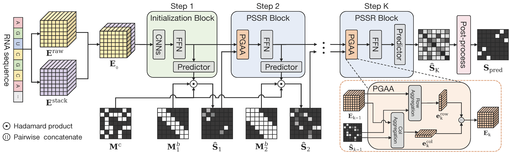

# StepFold: A Progressive Prediction Model for RNA Secondary Structure Prediction

[](https://doi.org/10.5281/zenodo.23086455)
[](https://doi.org/10.24433/CO.9487656.v3)
[](https://opensource.org/licenses/MIT)

This repository contains the implementation of **“StepFold: A Progressive Prediction Model for RNA Secondary Structure Prediction”** by Cheng Wang, Haozhuo Zheng, Gaurav Sharma, Maozu Guo, Quan Zou, and Yang Liu (accepted at IEEE BIBM 2026).



**StepFold** progressively predicts RNA base-pairing scores by expanding the allowed sequence-distance range from local to long-range interactions. This is a computational prediction strategy, not a simulation of the physical folding process.

-----

## ⚡ Quick Reproducibility via Code Ocean

For an immediate, zero-setup experience, we provide an interactive compute capsule on Code Ocean: **[https://doi.org/10.24433/CO.9487656.v3](https://doi.org/10.24433/CO.9487656.v3)**.

This capsule enables rapid reproduction of paper results and allows users to perform RNA secondary structure prediction on new sequences using the pre-trained parameters directly within your browser.

-----

## 📑 Table of Contents

- [Preparation Workflow](#-preparation-workflow)
  - [1. Clone & Environment Setup](#1-clone--environment-setup)
  - [2. Download Datasets & Checkpoints](#2-download-datasets--checkpoints)
  - [3. Preprocessing](#3-preprocessing)
- [Reproducing Paper Results](#-reproducing-paper-results)
- [Inference on New Sequences](#-inference-on-new-sequences)
- [Training from Scratch](#-training-from-scratch)

-----

## 🛠 Preparation Workflow

### 1\. Clone & Environment Setup

**Author's Implementation:**
* **OS:** Ubuntu 22.04 (Linux kernel 6.8.0)
* **Python:** 3.13 or newer, as specified in `pyproject.toml`
* **GPU & CUDA:** NVIDIA GPU with a driver compatible with the CUDA 12.8 (`cu128`) PyTorch wheels configured in `pyproject.toml`

First, clone the repository to your local machine and navigate into the project directory:

```bash
git clone https://github.com/ChengWang-hit/StepFold.git
cd StepFold
```

We use [`uv`](https://github.com/astral-sh/uv), an extremely fast Python package and project manager, to configure the environment.

If you don't have `uv` installed yet, you can install it quickly using `pip` (or refer to their [official installation guide](https://docs.astral.sh/uv/getting-started/installation/) for other methods):

```bash
pip install uv
```

Once `uv` is installed, run the following command in the project root to synchronize and install all dependencies specified in `pyproject.toml`:

```bash
# Install all required dependencies
uv sync

# Activate the environment
source .venv/bin/activate
```

### 2\. Download Datasets & Checkpoints

The dataset and checkpoint archives are publicly available from the following Zenodo record.

  * **Download Link:** [10.5281/zenodo.23086455](https://doi.org/10.5281/zenodo.23086455)

The archive names are `dataset.tar.gz` and `checkpoint.tar.gz`. They contain top-level `dataset/` and `checkpoint/` folders, respectively. From the project root, extract them into the directories expected by the code:

```bash
mkdir -p data ckpt
tar -xzf dataset.tar.gz -C data --strip-components=1
tar -xzf checkpoint.tar.gz -C ckpt --strip-components=1
```

The resulting layout before preprocessing is:

```text
StepFold/
├── ckpt/
│   ├── S1.pt
│   ├── S2.pt
│   ├── S3.pt
│   ├── S4.pt
│   └── training_all.pt
├── code/
├── configs/
├── data/
│   ├── ArchiveII/       # raw .pickle files
│   ├── bpRNA_1m/
│   ├── bpRNA_new/
│   ├── PDB/
│   └── RNAStralign/
├── pyproject.toml
└── README.md
```

In the checkpoint archive, `S3.pt` corresponds to bpRNA-1m and `S4.pt` to ArchiveII.

### 3\. Preprocessing

If using the raw dataset archive, generate the mask matrices and indexed pickle files needed by training and evaluation:

```bash
python code/generate_mask_matrix.py
```

This processes the five dataset groups and creates `data/PDB/TS123_hard_with_indices.pickle`. It rewrites generated mask/index files if run again; the original raw pickle files are kept. FASTA inference does not require dataset preprocessing.

-----

## 📊 Reproducing Paper Results

To evaluate the supplied checkpoints for the four paper scenarios (**S1, S2, S3, and S4**), run:

```bash
python code/test_all.py
```

The script uses `cuda:0` and evaluates S1 on bpRNA-new, S2 on PDB, S3 on the bpRNA-1m test set, and S4 on ArchiveII. It prints per-checkpoint F1, precision, and recall.

-----

## 🧬 Inference on New Sequences

You can easily use our pre-trained model to predict the secondary structure of your own custom RNA sequences.

**Step 1:** Add your RNA sequences to the demo FASTA file located at `inference_demo/demo.fasta`.

**Step 2:** Run the inference script:

```bash
python code/inference_fasta.py
```

**Step 3:** The predicted secondary structure results will be saved to `inference_demo/output/`. The script defaults to `cuda:0`; use `--device cpu` if necessary. Re-running it overwrites the standard output files for matching FASTA record names without deleting unrelated files.

-----

## 🚀 Training from Scratch

To train models for the four scenarios, use the corresponding scripts. Each script uses `cuda:0` by default in single-GPU mode; distributed training can be launched with `torchrun`.

```bash
# Train Stage 1
python code/train_S1.py

# Train Stage 2
python code/train_S2.py

# Train Stage 3
python code/train_S3.py

# Train Stage 4
python code/train_S4.py
```
